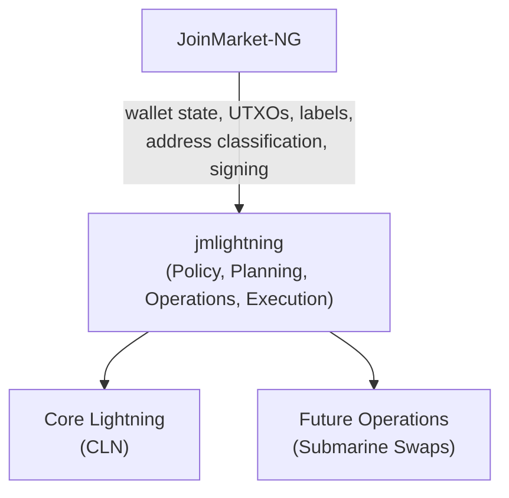
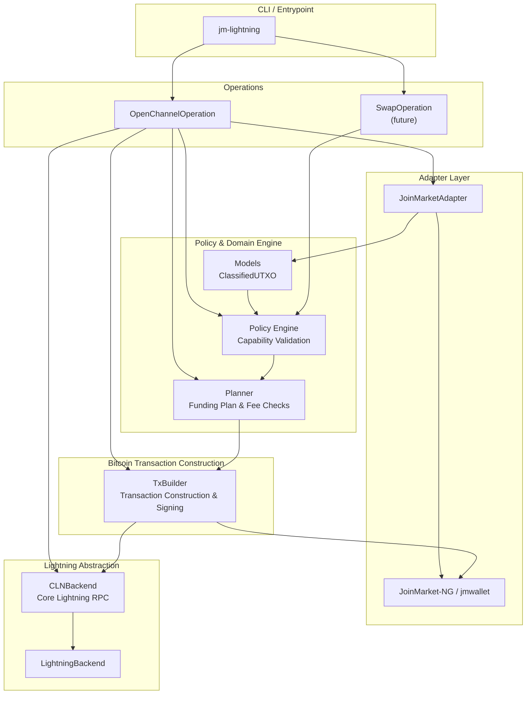
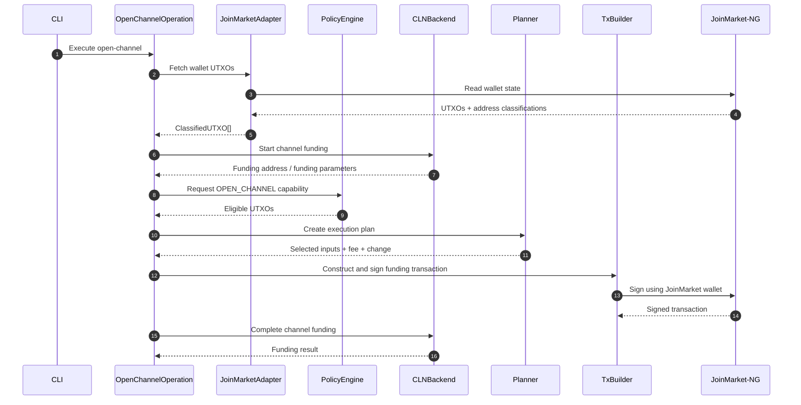
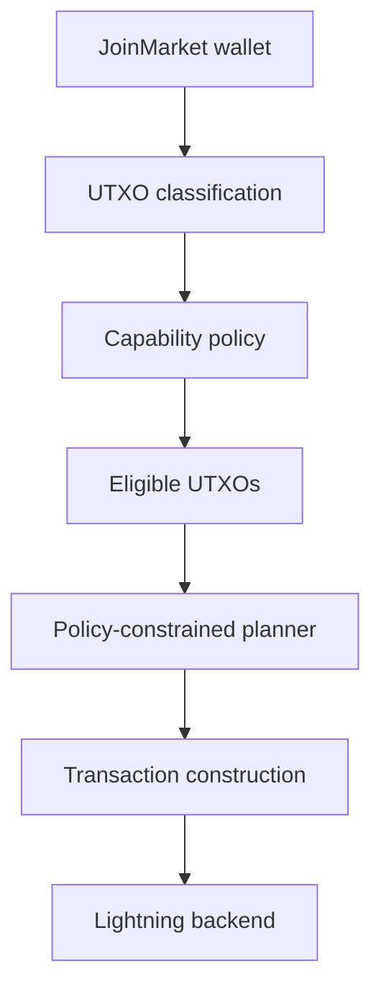
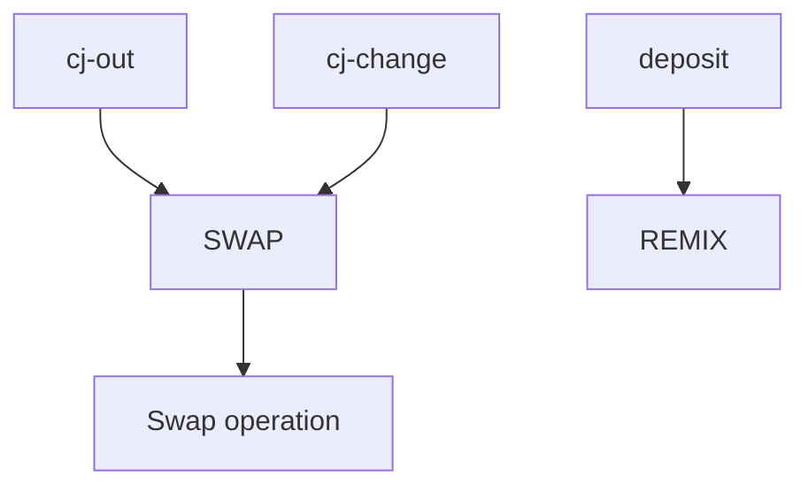
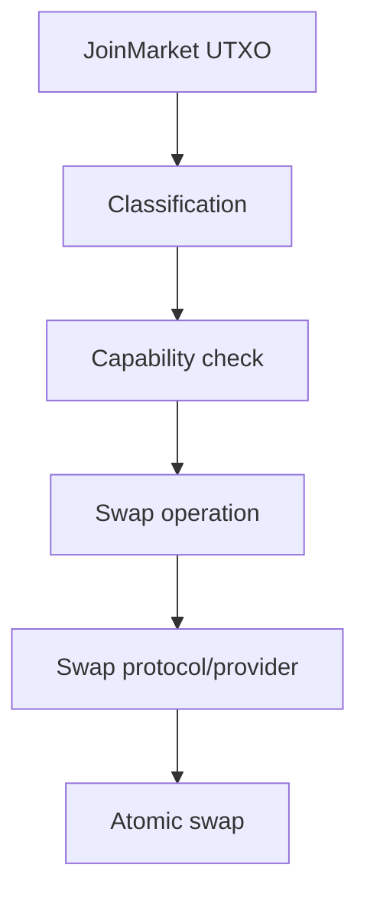
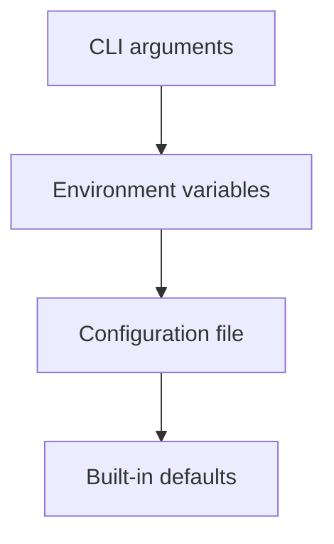
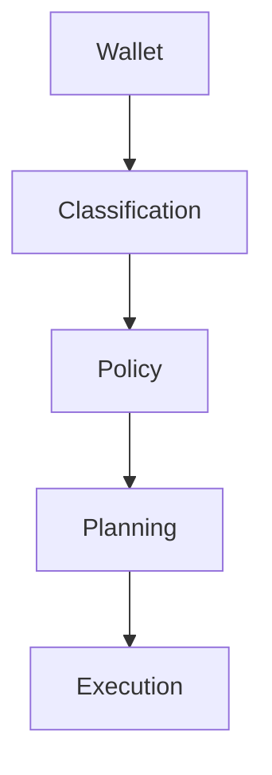
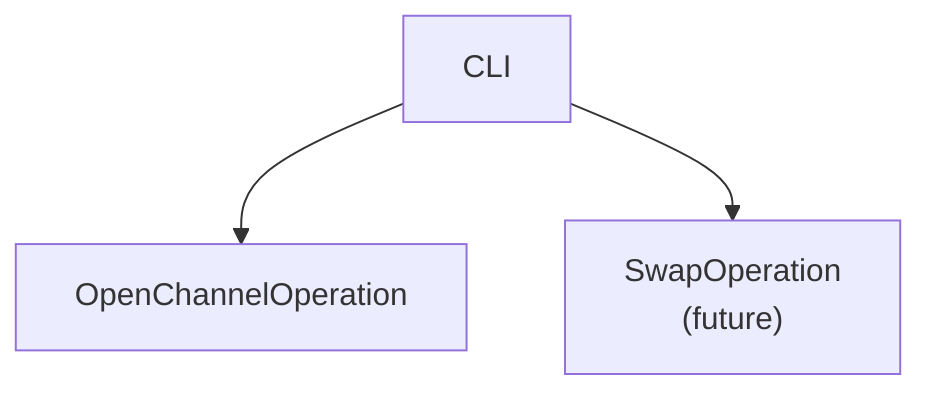

# ⚡ jmlightning

**JoinMarket-NG to Lightning Network Bridge** - A privacy-preserving, policy-driven bridge for funding Lightning channels and as the project evolves, executing atomic submarine swaps directly from JoinMarket-NG wallets using PeerSwap (via Core Lightning).

[](https://opensource.org/licenses/MIT)
[](https://www.python.org/)
[](https://github.com/astral-sh/ruff)
[](https://mypy-lang.org/)

[](https://github.com/aido/jmlightning/actions/workflows/ci.yml)
[](https://github.com/aido/jmlightning/actions/workflows/regtest.yml)
[](https://github.com/aido/jmlightning/actions/workflows/codeql.yml)
[](https://codecov.io/gh/aido/jmlightning)
---

## 📋 Overview

`jmlightning` connects **JoinMarket-NG** wallets with **Core Lightning (CLN)** while keeping JoinMarket's UTXO privacy policy at the centre of the transaction flow.

`jmlightning` uses the JoinMarket-NG wallet, wallet models and wallet configuration as the source of truth for Bitcoin funds and their privacy classification.

`jmlightning` is not primarily adding a new privacy property to JoinMarket-NG; it provides a controlled, selective external-spending path that avoids having to sweep/consolidate an entire mixdepth when funding Lightning.

The relationship can be thought of as:



JoinMarket-NG remains responsible for the wallet itself. `jmlightning` sits on top of that wallet and adds a controlled path from classified JoinMarket UTXOs to Lightning operations.

This distinction is important:

- JoinMarket-NG owns the wallet and its funds.
- JoinMarket-NG provides the wallet's UTXO and address information.
- `jmlightning` classifies and applies an operation policy to those UTXOs.
- `jmlightning` plans and constructs the resulting Bitcoin transaction.
- JoinMarket-NG is used to sign transactions with the wallet.
- CLN performs the Lightning-side channel operation.
- Future operations, such as submarine swaps, remain subject to the same UTXO policy.

The project separates three concerns:

1. **JoinMarket-NG** determines the origin and privacy classification of wallet UTXOs.
2. **The policy engine** determines what each classified UTXO is permitted to be used for.
3. **Operations and execution components** perform the requested action only after the policy layer has approved it.

The initial focus is Lightning channel funding. The architecture is designed to support additional operations, including submarine swaps, without allowing execution code to bypass JoinMarket's UTXO policy.

### The Core Privacy Problem

A JoinMarket wallet can contain UTXOs with very different privacy characteristics.

For example:

- **`cj-out`** - a CoinJoin output that has received the intended equal-value CoinJoin denomination.
- **`cj-change`** - change produced by a CoinJoin transaction and therefore linked to the CoinJoin inputs.
- **`deposit`** - an externally received, unmixed UTXO.
- **`non-cj-change`** - ordinary wallet change that has not acquired CoinJoin privacy.

These classifications matter when deciding what a UTXO can safely be used for.

In particular, using toxic or otherwise unsuitable change together with a CoinJoin output can create common-input ownership links and undermine the privacy gained through CoinJoin.

### The Solution

`jmlightning` follows a simple architectural rule:

> **JoinMarket-NG provides the wallet's UTXO classifications; jmlightning applies operation-specific policy to those classifications.**

The goal is not to replace JoinMarket's wallet selection or classification. It is to provide a selective path from a JoinMarket mixdepth to Lightning.

A generic sweep of a mixdepth can consolidate UTXOs with different privacy histories before the funds reach Lightning. `jmlightning` instead restricts funding selections to UTXOs permitted by the policy, allowing an eligible CoinJoin output to fund a channel without first sweeping unrelated mixdepth funds.

The Lightning layer does not independently decide whether a UTXO is suitable for channel funding.

Instead, UTXOs are classified by the JoinMarket adapter and passed through a capability-based policy engine. An operation such as opening a Lightning channel requests a capability such as `OPEN_CHANNEL` and only UTXOs possessing that capability may be selected.

This means that restrictions such as:

> `cj-change` must not be used to open a public Lightning channel

are enforced by the policy layer rather than relying on the CLI user to make the correct choice manually.

---

## 🏗 Architecture

The project is deliberately divided into layers.

The domain models and policy engine are independent of CLN and JoinMarket RPC details. Adapters translate external wallet/backend state into the internal domain model, while operations coordinate application workflows and execution components perform the required Lightning and Bitcoin transaction operations.



### Design Principles

The architecture is built around several principles:

- **Policy before execution** - transaction execution cannot bypass UTXO capability checks.
- **Operations coordinate workflows** - command-specific application logic belongs in `operations/`, not in the CLI.
- **Separation of concerns** - JoinMarket-specific code stays in the adapter layer.
- **Backend abstraction** - Lightning functionality is accessed through a backend interface rather than being hard-coded into the policy engine.
- **Deterministic planning** - UTXO selection and fee calculations are handled by a dedicated planner.
- **Minimal trust boundaries** - external systems provide data or execution services, while the local policy engine decides whether an operation is permitted.
- **Privacy by construction** - privacy-sensitive restrictions are encoded in software rather than left to operator discipline.

---

## 🔄 Channel Funding Flow

The channel funding path is conceptually:



The important property is that **the Lightning backend never gets to choose arbitrary JoinMarket UTXOs**.

The flow is:



---

## 🔒 Policy Engine & Capabilities

UTXOs are represented internally as classified coins with a set of capabilities.

The policy engine maps JoinMarket address classifications to permitted operations.

A simplified policy is:

| Address Status | Allowed Capabilities | Purpose |
|---|---|---|
| **`cj-out`** | `OPEN_CHANNEL`, `SWAP`, `SPLICE`, `REMIX` | CoinJoin output suitable for external spending and Lightning funding |
| **`cj-change`** | `SWAP`, `REMIX` | CoinJoin change; not permitted for direct channel funding |
| **`deposit`** | `REMIX` | Unmixed funds that should acquire CoinJoin privacy before external use |
| **`deposit-change`** | `REMIX` | Change from an external deposit |
| **other restricted states** | policy-dependent | Frozen, reserved, spent/reused or otherwise unsuitable coins remain restricted |

The exact policy is implemented in `policy.py` and should be treated as the authoritative source rather than the above table.

### Capability-Based Validation

An operation does not ask:

> "Is this UTXO a `cj-out`?"

Instead, it asks:

> "Does this UTXO have the capability required by this operation?"

For example:

```text
OPEN_CHANNEL
     │
     ▼
PolicyEngine
     │
     ├── cj-out       → allowed
     ├── cj-change    → denied
     ├── deposit      → denied
     └── restricted   → denied
```

This abstraction is important because it allows new operations to be introduced without duplicating privacy rules throughout the application.

---

## 🔁 Future Submarine Swap Support

The architecture also anticipates **atomic submarine swaps** as an alternative way of moving value between the on-chain and Lightning layers.

This is particularly important for UTXOs that should not be used directly for public Lightning channel funding.

For example, a future swap operation can use the existing capability model:



This provides a controlled path for `cj-change` and other permitted coins to leave the JoinMarket wallet without simply combining them with privacy-sensitive outputs in a public transaction.

The swap implementation is intentionally kept in the operations layer rather than introducing a separate swap-backend hierarchy.

The intended structure is:

```text
operations/
    └── swap.py
```

The future swap operation may integrate with services such as:

- **~Boltz~**
- **PeerSwap** via CLN

The particular provider or protocol should remain an implementation detail of the swap operation.

The important architectural constraint is that the swap operation must not bypass the same policy engine used by direct Lightning funding.

A future swap operation should therefore follow:



This keeps the privacy policy independent of the particular swap provider.

---

## 🧠 Policy-Constrained UTXO Selection

UTXO selection is not treated as a simple "find enough sats" problem.

The planner considers:

- UTXO eligibility
- required capability
- target amount
- transaction fees
- available inputs
- change
- privacy implications of combining inputs

Where possible, the planner prefers a **single eligible UTXO** rather than unnecessarily combining multiple UTXOs.

For example, if a 1,000,000 sat channel can be funded using one eligible 1,100,000 sat `cj-out`, there is generally no reason to combine several smaller outputs merely because the total is sufficient.

Combining inputs can create additional ownership information and should therefore be an explicit consequence of the planning process rather than an accidental side effect.

### Sweep Mode

A sweep is different from a fixed-amount funding request.

For `--amount 0`, the operation should consider the UTXOs that have already passed the required capability policy and construct a plan using those approved inputs.

Sweep mode therefore does not bypass the policy engine.

---

## 📂 Repository Structure

```text
.
├── pyproject.toml
├── LICENCE
├── README.md
├── src/
│   └── jmlightning/
│       ├── __init__.py
│       ├── cli.py
│       ├── config.py
│       ├── models.py
│       ├── policy.py
│       ├── planner.py
│       ├── tx_builder.py
│       │
│       ├── adapters/
│       │   ├── __init__.py
│       │   └── joinmarket.py
│       │
│       ├── lightning/
│       │   ├── __init__.py
│       │   ├── backend.py
│       │   └── cln.py
│       │
│       └── operations/
│           ├── __init__.py
│           ├── open_channel.py
│           ├── splice.py
│           └── swap.py
│
└── tests/
    ├── conftest.py
    │
    ├── integration/
    │   └── test_open_channel_regtest.py
    │
    └── unit/
        ├── test_cln.py
        ├── test_joinmarket_adapter.py
        ├── test_open_channel.py
        ├── test_planner.py
        ├── test_policy.py
        └── test_tx_builder.py
```

### Main Components

#### `cli.py`

Defines the command-line interface and dispatches commands to application operations.

The CLI is intentionally kept thin. It handles command-line arguments and configuration, while operation-specific orchestration belongs in `operations/`.

#### `operations/open_channel.py`

Implements the Lightning channel-opening operation.

`OpenChannelOperation` coordinates:

- JoinMarket wallet UTXO discovery
- UTXO classification
- capability validation
- fee retrieval
- policy-constrained planning
- transaction construction and signing
- CLN channel funding

The operation does not define the JoinMarket privacy rules itself. Those remain in the policy engine.

#### `operations/swap.py`

Placeholder for future submarine-swap operations.

Swap provider and protocol-specific implementation belongs here rather than in the CLI or policy engine.

The swap operation must use the same capability-based policy model as other operations.

#### `models.py`

Contains the core domain objects used by the application.

The models describe UTXOs, their JoinMarket classification and the capabilities that can be applied to them.

These models deliberately do not depend on CLN RPC or JoinMarket-specific execution code.

#### `policy.py`

Contains the capability-based policy engine.

This is the main privacy boundary of the application.

#### `planner.py`

Responsible for turning eligible UTXOs and an execution request into an `ExecutionPlan`.

The planner handles UTXO selection and fee-aware transaction planning.

#### `tx_builder.py`

Constructs and signs Bitcoin transactions using the wallet integration.

It is intentionally downstream of policy evaluation and planning.

#### `adapters/joinmarket.py`

Provides the boundary between `jmlightning` and JoinMarket-NG.

It obtains wallet information and translates JoinMarket wallet state into the project's internal `ClassifiedUTXO` representation.

#### `lightning/backend.py`

Defines the Lightning backend abstraction.

The rest of the application can therefore operate against a Lightning interface rather than depending directly on CLN.

#### `lightning/cln.py`

Provides the Core Lightning implementation using CLN's JSON-RPC interface.

---

## 🚀 Installation

### Requirements

- Python **3.11 or newer**
- JoinMarket-NG
  - `jmcore`
  - `jmwallet`
- Core Lightning for channel funding
- A CLN JSON-RPC Unix socket accessible by the process running `jmlightning`

The exact dependency versions are defined by `pyproject.toml`.

### Clone the Repository

```bash
git clone https://github.com/your-repo/jmlightning.git
cd jmlightning
```

### Install

```bash
pip install -e .
```

---

## ⚙️ Configuration

`jmlightning` is designed to operate within the JoinMarket-NG configuration environment.

Where a setting belongs to the JoinMarket wallet or its Bitcoin backend, the JoinMarket-NG configuration should remain the source of truth rather than introducing a second, conflicting configuration system.

In particular, JoinMarket-NG configuration determines the wallet environment in which `jmlightning` operates, including things such as:

- Bitcoin network and backend configuration
- JoinMarket data/configuration locations
- wallet-related configuration
- JoinMarket wallet/backend settings

`jmlightning` adds configuration only for concerns that belong specifically to the bridge, such as Lightning backend settings and operation-specific options.

Configuration is designed to support command-line options, environment variables and configuration files.

The intended precedence is:



Configuration is kept separate from the policy and domain models so that changing deployment configuration does not alter the privacy rules.

If supported by the installed version, the configuration can be initialised with:

```bash
jm-lightning config-init
```

An example configuration may look like:

```toml
[lightning]
cln_socket = "/run/lightningd/lightning-rpc"
default_fee_priority = "normal"
```

Do not commit RPC credentials, wallet secrets, mnemonics or other sensitive configuration to source control.

---

## 💻 Usage

### CLI Structure

Commands follow the JoinMarket-NG-style subcommand structure:

```text
jm-lightning <command> <parameter> <parameter>
```

The CLI command selects an application operation. The operation then applies the appropriate capability policy and coordinates the required wallet, planning and backend services.

---

### Open a Lightning Channel

A channel funding operation requests the `OPEN_CHANNEL` capability.

For example:

```bash
jm-lightning open-channel \
  02abc1234567890abcdef1234567890abcdef1234567890abcdef1234567890 \
  --amount 1000000 \
  --mixdepth 1 \
  --cln-socket /run/lightningd/lightning-rpc
```

The important part of this command is not simply the requested amount.

The application will:

1. Dispatch the command to `OpenChannelOperation`.
2. Connect to the JoinMarket wallet.
3. Discover and classify available UTXOs.
4. Ask the policy engine for UTXOs capable of `OPEN_CHANNEL`.
5. Reject UTXOs that do not have that capability.
6. Obtain the Lightning funding parameters.
7. Plan the funding transaction, including fees.
8. Construct and sign the Bitcoin transaction.
9. Complete the Lightning funding operation through CLN.
10. Broadcast the resulting transaction as required by the funding workflow.
11. Release temporary JoinMarket UTXO locks.

The operation is implemented in:

```text
src/jmlightning/operations/open_channel.py
```

The CLI itself is responsible for parsing the command and dispatching the request to the operation.

### Typical Options

```text
PEER_ID
    Lightning node public key.

--amount
    Funding amount in satoshis.

--mixdepth
    JoinMarket mixdepth from which eligible UTXOs are selected.

--cln-socket
    Path to the Core Lightning JSON-RPC Unix socket.

--mnemonic-file
    JoinMarket wallet seed/mnemonic source, where supported.
```

Run:

```bash
jm-lightning --help
```

and:

```bash
jm-lightning open-channel --help
```

for the options supported by the installed version.

---

### Sweep Mode

A channel funding request with:

```bash
--amount 0
```

is treated as a sweep of the policy-approved UTXOs.

For example:

```bash
jm-lightning open-channel \
  02abc1234567890abcdef1234567890abcdef1234567890abcdef1234567890 \
  --amount 0 \
  --mixdepth 1 \
  --cln-socket /run/lightningd/lightning-rpc
```

Sweep mode does **not** bypass the capability policy.

Only UTXOs permitted for `OPEN_CHANNEL` are included.

---

## 🐍 Programmatic Architecture

The project is intended to be usable as a Python library as well as through the CLI.

A simplified conceptual flow is:

```python
from jmlightning.policy import Capability, PolicyEngine
from jmlightning.planner import Planner

policy = PolicyEngine()

eligible = policy.filter_eligible(
    utxos=adapter.get_utxos(mixdepth=0),
    required_capability=Capability.OPEN_CHANNEL,
)

planner = Planner()

plan = planner.create_plan(
    utxos=eligible,
    target_amount=1_000_000,
    fee_rate=fee_rate,
    destination_address=funding_address,
)
```

The exact public API should be taken from the installed version of the package.

The important architectural point is that the planner receives **already policy-filtered UTXOs**.

The planner is not intended to override the policy engine.

---

## 🧪 Testing

The project currently has a test suite covering:

- Core Lightning backend behaviour
- JoinMarket wallet adaptation
- UTXO classification and policy enforcement
- UTXO planning and selection
- Bitcoin transaction construction

Run the complete test suite with:

```bash
pytest
```

### Type Checking

The project uses mypy for static type checking.

Run:

```bash
mypy .
```

The source and test suite are intended to remain type-safe.

### Linting

Run:

```bash
ruff check .
```

### Formatting

Run:

```bash
ruff format .
```

A useful development check is therefore:

```bash
ruff check .
ruff format --check .
mypy .
pytest
```

---

## 🔐 Security & Privacy

`jmlightning` handles Bitcoin UTXOs, wallet information and Lightning funding transactions. Security and privacy are therefore first-class design requirements.

### UTXO Policy Is a Security Boundary

The policy engine is not merely a convenience filter.

It exists to prevent operations from using UTXOs in ways that violate the wallet's privacy policy.

Code that executes an operation should not independently construct an unrestricted list of JoinMarket UTXOs.

Instead:



should remain the normal path.

### Avoid Unnecessary Input Merging

Combining multiple UTXOs can reveal ownership relationships.

The planner therefore prefers appropriate single-input solutions when possible.

This is a privacy preference, not merely a fee optimisation.

### Toxic Change

`cj-change` should not be treated as equivalent to a CoinJoin output.

A CoinJoin change output can carry transaction-history information that makes it inappropriate for certain external payments.

For this reason, the policy engine intentionally distinguishes `cj-out` from `cj-change` rather than treating both as generic "CoinJoin coins".

### 🔒 Privacy-Oriented Funding

The following options can be used to reduce unnecessary on-chain linkage when funding a Lightning channel:

- `--single-input-utxo` - uses exactly one eligible `cj-out`, avoiding common-input linkage between multiple JoinMarket UTXOs.
- `--single-input-address` - permits multiple inputs only when they belong to the same JoinMarket address, avoiding cross-address input linkage while allowing more flexible funding.
- `--no-change` - requires the selected inputs to fund the channel and transaction fee without creating a JoinMarket change output.

Using `--single-input-utxo --no-change` provides the strongest isolation: **one `cj-out` → one Lightning funding output, with no unrelated inputs or JoinMarket change.**

### Lightning RPC Security

CLN's JSON-RPC socket grants significant control over the Lightning node.

The Unix socket should therefore have restrictive permissions and should not be exposed unnecessarily to other local users or processes.

For example:

```bash
chmod 600 /run/lightningd/lightning-rpc
```

The exact ownership and permission model should match the CLN deployment.

### Secrets

Do not place any of the following in the repository:

- JoinMarket wallet mnemonics
- wallet seeds
- Bitcoin RPC passwords
- CLN credentials
- swap provider credentials
- private keys
- generated wallet files

Use appropriate secret-management mechanisms for production deployments.

---

## 🧩 Extensibility

The project is designed around clear interfaces and operation boundaries rather than tying the entire application to one execution path.

### Operations

Application-level functionality belongs in `operations/`.

Conceptually:



Each operation coordinates its own workflow while obtaining UTXOs through the shared capability policy.

This keeps `cli.py` focused on command parsing and dispatch while preventing operation-specific orchestration from accumulating in a single CLI module.

### Lightning Backends

The Lightning abstraction allows future implementations beyond CLN.

Conceptually:

```text
LightningBackend
       │
       ├── CLNBackend
       ├── Future backend
       └── Future backend
```

The policy and planning layers should not need to know which Lightning implementation is being used.

### Future Swap Operations

Submarine swap functionality will live in:

```text
operations/swap.py
```

The operation may communicate with external swap protocols or providers as required.

Those implementation details should remain within the operation rather than introducing a separate swap-backend hierarchy unless the requirements later demonstrate a need for one.

The policy engine remains independent of the swap implementation.

### JoinMarket Adapters

JoinMarket-NG interaction is isolated behind an adapter.

This means the core policy and planning code can work with the project's internal models without depending on the details of `jmwallet`.

---

## 🗺 Roadmap

The project is being developed incrementally.

### Current Focus

- JoinMarket-NG wallet integration
- UTXO classification
- Capability-based policy enforcement
- Policy-constrained UTXO selection
- Core Lightning channel funding
- Transaction construction and signing
- Operation-oriented CLI architecture
- Strong typing and automated tests

### Future Work

Potential future development includes:

- **Submarine swaps**
  - ~Boltz integration~
  - PeerSwap integration via CLN
  - Additional swap protocols/providers as appropriate

- **Additional Lightning backends**

- **More sophisticated policy-constrained coin selection**

- **Improved transaction and fee planning**

- **Additional wallet recovery/import classification**

- **Expanded integration testing against real JoinMarket-NG and CLN environments**

The key constraint for future functionality is that new execution paths must preserve the existing policy boundary.

New operations should not be allowed to bypass UTXO capability checks simply because they provide a different way of moving funds.

---

## 🧭 Design Philosophy

The project can be summarised by four rules:

### 1. Classification before selection

The system first determines what a UTXO is before deciding whether it should be spent.

### 2. Policy before execution

No Lightning operation or swap implementation should decide whether a JoinMarket UTXO is appropriate for an operation.

### 3. Capability instead of scattered special cases

Operations request capabilities such as:

```text
OPEN_CHANNEL
SWAP
REMIX
SPLICE
```

rather than embedding JoinMarket-specific status checks throughout the codebase.

### 4. Privacy is part of correctness

A transaction that is valid according to Bitcoin consensus can still be incorrect according to the privacy policy of the wallet.

`jmlightning` therefore treats privacy constraints as part of application correctness rather than as optional user guidance.

---

## 📜 Licence

`jmlightning` is distributed under the **MIT Licence**.

See [LICENCE](LICENCE) for the full licence text.

---

## ⚠️ Project Status

`jmlightning` is experimental software.

It operates at the intersection of Bitcoin wallet management, CoinJoin privacy and Lightning channel funding. Users should understand the transaction and privacy implications before using it with real funds.

Always test with:

- Bitcoin regtest/testnet environments where appropriate
- Small amounts
- Dedicated development wallets

Do not assume that passing the automated test suite means that a deployment is safe for production use.

---

## 🤝 Contributing

Contributions are welcome.

Before submitting changes:

```bash
ruff check .
ruff format --check .
mypy .
pytest
```

Changes affecting privacy policy, UTXO classification, coin selection or transaction construction should include tests demonstrating the intended behaviour.

In particular, privacy-sensitive policy changes should explicitly test both:

- operations that **must be permitted** and
- operations that **must be rejected**.

The goal is to make privacy policy enforceable in code and difficult to accidentally bypass during future development.
