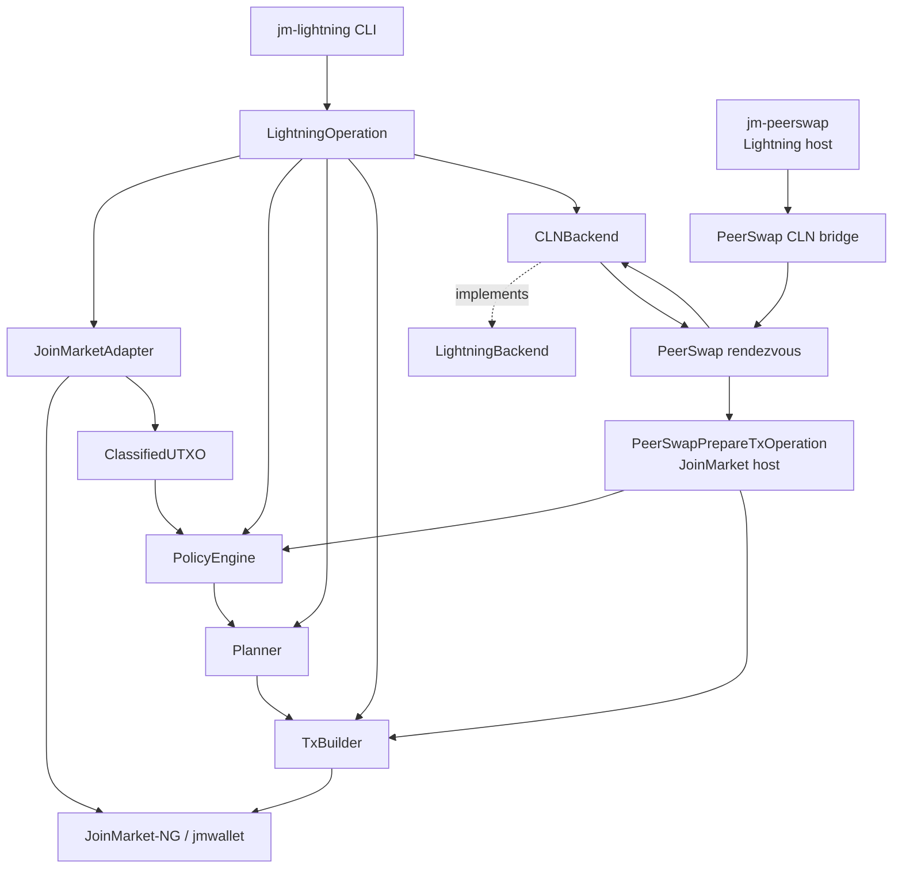
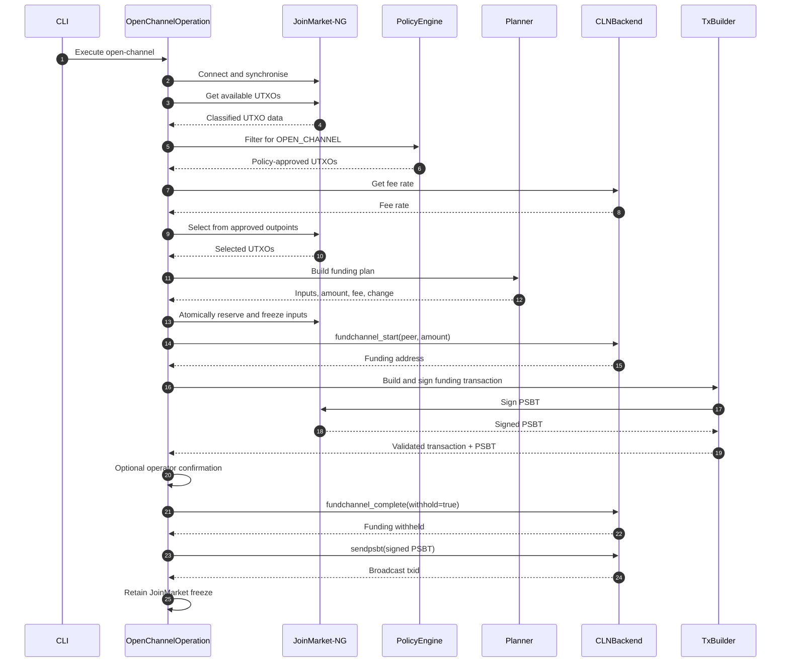
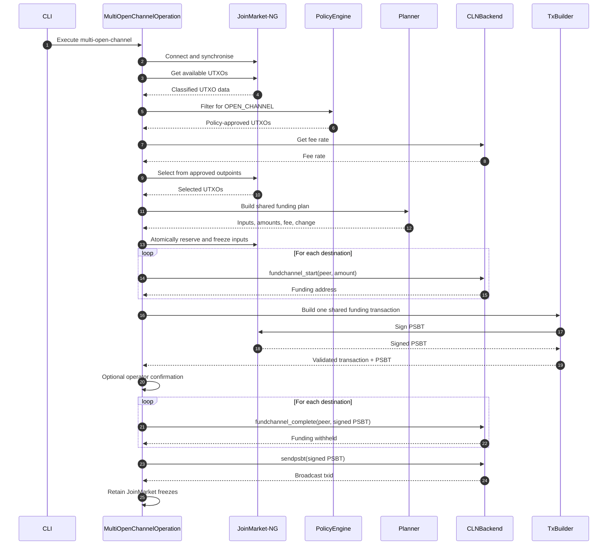
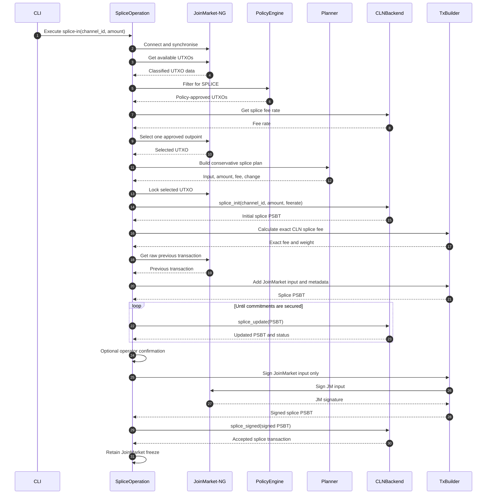
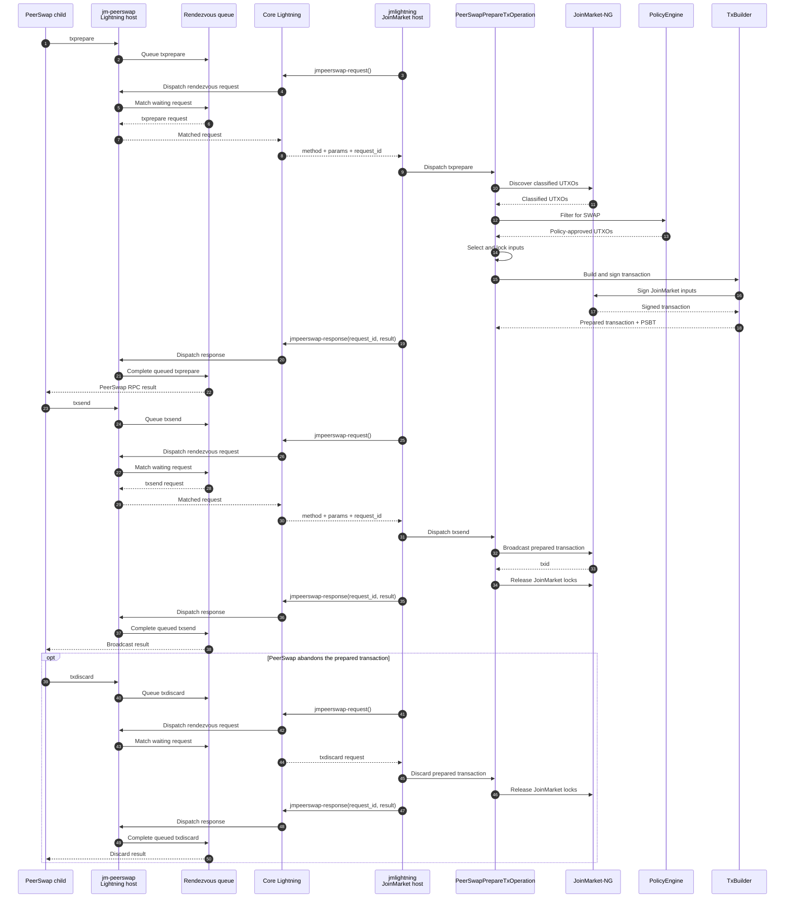

# ⚡ jmlightning

**JoinMarket-NG to Lightning Network Bridge** - A privacy-conscious, policy-driven bridge for funding Lightning channels, channel splice-in operations and PeerSwap transactions from JoinMarket-NG wallet UTXOs.

[](https://opensource.org/licenses/MIT)
[](https://www.python.org/)
[](https://github.com/astral-sh/ruff)
[](https://mypy-lang.org/)

[](https://github.com/aido/jmlightning/actions/workflows/static.yml)
[](https://github.com/aido/jmlightning/actions/workflows/unit.yml)
[](https://github.com/aido/jmlightning/actions/workflows/regtest.yml)
[](https://github.com/aido/jmlightning/actions/workflows/codeql.yml)
[](https://codecov.io/gh/aido/jmlightning)
---

## 📋 Overview

`jmlightning` connects **JoinMarket-NG** wallets with a **Lightning** node while keeping JoinMarket's UTXO privacy policy at the centre of the transaction flow.

`jmlightning` uses the JoinMarket-NG wallet, wallet models and wallet configuration as the source of truth for Bitcoin funds and their privacy classification.

`jmlightning` is not primarily adding a new privacy property to JoinMarket-NG; it provides a controlled, selective external-spending path that avoids having to sweep/consolidate an entire mixdepth when funding Lightning.

JoinMarket-NG remains responsible for the wallet itself. `jmlightning` sits on top of that wallet and adds a controlled path from classified JoinMarket UTXOs to Lightning operations.

The relationship can be thought of as:

- JoinMarket-NG owns the wallet and its funds.
- JoinMarket-NG provides the wallet's UTXO and address information.
- `jmlightning` translates those classifications into internal objects and applies an operation policy to them.
- `jmlightning` plans and constructs the resulting Bitcoin transaction.
- JoinMarket-NG is used to sign transactions with the wallet.
- The Lightning node performs the Lightning-side channel operation.
- PeerSwap and future operations remain subject to the same UTXO policy.

The project separates three concerns:

1. **JoinMarket-NG** determines the origin and privacy classification of wallet UTXOs.
2. **The policy engine** determines what each classified UTXO is permitted to be used for.
3. **Operations and execution components** perform the requested action only after the policy layer has approved it.

The project supports Lightning channel funding, channel splice-in operations and PeerSwap through operation-specific paths that cannot bypass JoinMarket's UTXO policy.

### The Privacy Problem

A JoinMarket wallet can contain UTXOs with very different privacy characteristics.

For example:

- **`cj-out`** - a CoinJoin output that has received the intended equal-value CoinJoin denomination.
- **`cj-change`** - change produced by a CoinJoin transaction and therefore linked to the CoinJoin inputs.
- **`deposit`** - an externally received, unmixed UTXO.
- **`non-cj-change`** - ordinary wallet change that has not acquired CoinJoin privacy.

These classifications matter when deciding what a UTXO can safely be used for.

In particular, using toxic or otherwise unsuitable change together with a CoinJoin output can create common-input ownership links and undermine the privacy gained through CoinJoin.

### The Solution

`jmlightning` follows a simple architectural rule:

> **JoinMarket-NG provides the wallet's UTXO classifications; jmlightning applies operation-specific policy to those classifications.**

The goal is not to replace JoinMarket's wallet selection or classification. It is to provide a selective path from a JoinMarket mixdepth to Lightning.

A generic sweep of a mixdepth can consolidate UTXOs with different privacy histories before the funds reach Lightning. `jmlightning` instead restricts funding selections to UTXOs permitted by the policy, allowing an eligible CoinJoin output to fund a channel without first sweeping unrelated mixdepth funds.

The Lightning layer does not independently decide whether a UTXO is suitable for channel funding.

Instead, UTXOs are classified by the JoinMarket adapter and passed through a capability-based policy engine. An operation such as opening a Lightning channel requests a capability such as `OPEN_CHANNEL` and only UTXOs possessing that capability may be selected.

This means that restrictions such as:

> `cj-change` must not be used to open a public Lightning channel

are enforced by the policy layer rather than relying on the CLI user to make the correct choice manually.

---

## 🚀 Installation

### Requirements

- Python **3.11 or newer**
- JoinMarket-NG (`jmcore` and `jmwallet`) for the `jmlightning` host
- Core Lightning for channel funding
- The upstream PeerSwap plugin if PeerSwap is enabled
- A CLN JSON-RPC Unix socket accessible by the process running `jmlightning`

For the current PeerSwap integration, the `jmlightning` process must be able to reach the Lightning node's CLN JSON-RPC socket. The current transport is therefore a **Unix-domain socket** and does not yet provide a fully separated two-host deployment.

For a normal channel-funding deployment only `jmlightning` is required. PeerSwap adds the separate `jmpeerswap` CLN plugin on the Lightning node.

The exact dependency versions are defined by `pyproject.toml`.

### Clone the Repository

```bash
git clone https://github.com/aido/jmlightning.git
cd jmlightning
```

The repository contains two independently installable Python projects:

- `jmlightning/` - the JoinMarket-NG bridge library and `jm-lightning` CLI.
- `jmpeerswap/` - the standalone Core Lightning plugin bridge used when PeerSwap is enabled.

They have deliberately separate `pyproject.toml` files and can be installed on different hosts.

### Install jmlightning

Install `jmlightning` on the host that has access to the JoinMarket-NG wallet and will run the `jm-lightning` commands:

```bash
cd jmlightning
pip install -e .
```

This installs the `jmlightning` package and the `jm-lightning` CLI.

### Install jmpeerswap

If PeerSwap is to be used, install the `jmpeerswap` plugin on the **Core Lightning node**. It is a separate package from `jmlightning` and does not need the JoinMarket wallet on the Lightning host:

```bash
cd jmpeerswap
pip install -e .
```

This installs the `jm-peerswap` CLN plugin entry point. The plugin runs on the Lightning node and proxies the upstream PeerSwap plugin while providing the rendezvous boundary used by `jmlightning`.

The upstream PeerSwap plugin is still required. Configure `jm-peerswap` to proxy the upstream PeerSwap executable if it is not available as `peerswap` on the Lightning node.

The two installations are independent: `jmlightning` belongs on the JoinMarket host, while `jmpeerswap` belongs on the Lightning node. They communicate through the Core Lightning RPC/rendezvous interface; `jmpeerswap` does not import or require the `jmlightning` Python package. The hosts therefore do not need to share a filesystem or Python environment.

On the Lightning node, enable the bridge plugin in the CLN configuration (or with the equivalent `lightningd` option):

```text
plugin=/path/to/venv/bin/jm-peerswap
```

`jm-peerswap` defaults to launching an upstream PeerSwap executable named `peerswap`. If the upstream executable is installed elsewhere, configure the bridge's `peerswap-plugin` option to point to it.

The JoinMarket host does not need to install `jmpeerswap` just to run `jm-lightning`. Conversely, the Lightning node does not need the `jmlightning` package or JoinMarket wallet dependencies merely to run `jm-peerswap`.

---

## ⚙️ Configuration

`jmlightning` reuses JoinMarket-NG configuration and wallet settings rather than introducing a second wallet configuration system.

The CLI resolves JoinMarket-NG settings for the network, Bitcoin backend, data directory, wallet configuration and mnemonic. The underlying configuration precedence is provided by JoinMarket-NG; for bridge-specific command options, use the CLI options shown by `--help`.

Initialise the JoinMarket-NG configuration with:

```bash
jm-lightning config-init
```

You can specify the data directory or configuration file explicitly:

```bash
jm-lightning config-init \
  --data-dir /path/to/joinmarket-data \
  --config-file /path/to/config.toml
```

The current `open-channel` command does **not** consume a separate `jmlightning` `[lightning]` TOML section. The CLN RPC socket is supplied with `--cln-socket`; amount, mixdepth, mnemonic file and confirmation behaviour are also command-line options.

Do not commit RPC credentials, wallet secrets, mnemonics or other sensitive configuration to source control.

## 💻 Usage

### CLI Structure

Commands follow the JoinMarket-NG-style subcommand structure:

```text
jm-lightning <command> <parameter> <parameter>
```

The CLI command selects an application operation. The operation then applies the appropriate capability policy and coordinates the required wallet, planning and backend services.

---

### Open a Lightning Channel

A channel funding operation requests the `OPEN_CHANNEL` capability.

For example:

```bash
jm-lightning open-channel \
  02abc1234567890abcdef1234567890abcdef1234567890abcdef1234567890 \
  --amount 1000000 \
  --mixdepth 1 \
  --cln-socket /run/lightningd/lightning-rpc
```

The important part of this command is not simply the requested amount.

The application will:

1. Dispatch the command to `OpenChannelOperation`.
2. Connect to the JoinMarket wallet.
3. Discover and classify available UTXOs.
4. Ask the policy engine for UTXOs capable of `OPEN_CHANNEL`.
5. Reject UTXOs that do not have that capability.
6. Obtain a fee estimate from CLN.
7. Select and plan the funding transaction from the approved UTXOs.
8. Lock the selected UTXOs before starting CLN funding.
9. Ask CLN for a funding address and construct/sign the funding transaction.
10. Optionally ask the operator to confirm the transaction.
11. Complete the CLN funding operation with the signed PSBT withheld.
12. Send the PSBT through CLN, which finalises and broadcasts the funding transaction.
13. Retain the JoinMarket freeze after successful broadcast; ambiguous failures keep the inputs locked for recovery.

The operation is implemented in:

```text
src/jmlightning/operations/open_channel.py
```

The CLI itself is responsible for parsing the command and dispatching the request to the operation.

Run:

```bash
jm-lightning --help
```

and:

```bash
jm-lightning open-channel --help
```

for the options supported by the installed version.

---

### Open Multiple Lightning Channels

A multi-channel funding operation opens multiple CLN channels using **one shared Bitcoin transaction**. It requests the same `OPEN_CHANNEL` capability as a single channel open, so every JoinMarket input must independently satisfy the existing channel-funding policy.

Each destination is supplied as a repeatable `--destination` option containing a peer ID and channel amount:

```bash
jm-lightning multi-open-channel \
  --destination 02abc1234567890abcdef1234567890abcdef1234567890abcdef1234567890:1000000 \
  --destination 03def4567890abcdef1234567890abcdef1234567890abcdef1234567890:1500000 \
  --mixdepth 1 \
  --cln-socket /run/lightningd/lightning-rpc
```

The amounts are the individual channel funding amounts. The JoinMarket planner selects enough policy-approved UTXOs to fund their combined value, the transaction fee and any required change.

The application will:

1. Dispatch the command to `MultiOpenChannelOperation`.
2. Connect to the JoinMarket wallet.
3. Discover and classify available UTXOs.
4. Ask the policy engine for UTXOs capable of `OPEN_CHANNEL`.
5. Reject UTXOs that do not have that capability.
6. Obtain a fee estimate from CLN.
7. Select and plan the combined funding transaction from the approved UTXOs.
8. Lock the selected UTXOs before starting CLN funding.
9. Ask CLN for a funding address for each destination.
10. Construct and sign one Bitcoin transaction containing all channel funding outputs and any JoinMarket change.
11. Optionally ask the operator to confirm the shared transaction.
12. Complete each CLN channel against the same signed PSBT while withholding broadcast.
13. Send the signed PSBT once through CLN, which finalises and broadcasts the shared funding transaction.
14. Retain the JoinMarket freezes after successful broadcast; ambiguous failures keep the inputs locked for recovery.

The operation is implemented in:

```text
src/jmlightning/operations/multi_open_channel.py
```

The CLI itself is responsible for parsing the repeatable destinations and dispatching the request to the operation.

Run:

```bash
jm-lightning multi-open-channel --help
```

for the options supported by the installed version.

The important property is that the channel funding outputs share **one Bitcoin transaction**. This avoids creating one independent on-chain funding transaction per channel while preserving the same JoinMarket capability policy used by the single-channel operation.

---

### Splice In to an Existing Lightning Channel

A splice-in operation adds a JoinMarket UTXO to an existing Lightning channel without closing the channel. The operation requests the `SPLICE` capability, so only UTXOs permitted by the policy engine may be selected.

For example:

```bash
jm-lightning splice-in \
  1234567890abcdef1234567890abcdef1234567890abcdef1234567890abcdef \
  --amount 1000000 \
  --mixdepth 1 \
  --cln-socket /run/lightningd/lightning-rpc
```

The channel ID identifies the existing CLN channel to splice into. The requested amount is the amount of new channel capacity contributed by the JoinMarket input; the CLN splice transaction also contains the existing channel funding input and the transaction fee.

The application will:

1. Dispatch the command to `SpliceOperation`.
2. Connect to the JoinMarket wallet.
3. Discover and classify available UTXOs.
4. Ask the policy engine for UTXOs capable of `SPLICE`.
5. Reject UTXOs that do not have that capability.
6. Obtain CLN's recommended splice fee rate.
7. Select exactly one policy-approved JoinMarket UTXO and build a conservative fee-aware plan.
8. Lock the selected UTXO before starting the CLN splice.
9. Ask CLN to initialise the splice and obtain the negotiated PSBT.
10. Calculate the exact initiator fee from the CLN splice PSBT.
11. Add the JoinMarket input and required PSBT metadata to the CLN transaction.
12. Exchange the PSBT with CLN until the splice commitments are secured.
13. Optionally ask the operator to confirm the negotiated splice transaction.
14. Sign only the JoinMarket input with the JoinMarket wallet.
15. Submit the signed PSBT to CLN with `splice_signed`.
16. Retain the JoinMarket freeze after CLN accepts the splice; ambiguous failures keep the input locked for recovery.

CLN remains the owner of the splice transaction. `jmlightning` does not rebuild the existing channel funding transaction independently; it contributes a policy-approved JoinMarket input to the PSBT negotiated by CLN.

The operation is implemented in:

```text
src/jmlightning/operations/splice.py
```

The CLI itself is responsible for parsing the command and dispatching the request to the operation.

Run:

```bash
jm-lightning splice-in --help
```

for the options supported by the installed version.

---

### PeerSwap

PeerSwap enables Lightning Network nodes to balance their channels by facilitating atomic swaps with direct peers. PeerSwap enhances decentralisation of the Lightning Network by enabling all nodes to be their own swap provider. No centralised coordinator, no 3rd party rent collector and lowest cost channel balancing means small nodes can better compete with large nodes.
Further information may be found at: https://github.com/ElementsProject/peerswap

PeerSwap integration has two separate components:

- `jmlightning` runs on the JoinMarket host and exposes the `peerswap-swap-in` and `peerswap-swap-out` commands. It owns the JoinMarket wallet access, UTXO policy and transaction preparation.
- `jmpeerswap` runs as a Core Lightning plugin on the Lightning node. It proxies the upstream PeerSwap plugin and intercepts `txprepare`, `txsend` and `txdiscard` so the JoinMarket side can perform the wallet-specific transaction work.

The two components are logically separated into a JoinMarket side and a Lightning side, but the **current transport does not yet provide true host separation**. `jmlightning` currently communicates with CLN through its Unix-domain JSON-RPC socket, so the JoinMarket host must have access to that socket. In practice this means the current deployment is normally on one host, or requires an administrator-controlled mechanism for exposing/forwarding the Unix socket.

A future transport will optionally use a **TCP socket** for the rendezvous boundary so the JoinMarket host and Lightning host can be genuinely separate machines without sharing a Unix socket or filesystem. That transport is planned but is **not implemented yet**.

The PeerSwap transaction path requests the `SWAP` capability. This is intentionally separate from `OPEN_CHANNEL` and `SPLICE`, so swap funding follows the policy assigned to CoinJoin change and other swap-eligible UTXOs.

The PeerSwap CLN plugin is installed as the `jm-peerswap` entry point. It proxies the upstream PeerSwap plugin while intercepting the transaction RPCs that must be funded by JoinMarket-NG. The plugin is intentionally a standalone package so it can be installed directly on the Lightning node without installing the JoinMarket wallet integration there.

#### PeerSwap Swap-In

For example:

```bash
jm-lightning peerswap-swap-in \
  <short-channel-id> \
  1000000 \
  --mixdepth 1 \
  --cln-socket /run/lightningd/lightning-rpc
```

The command initiates PeerSwap's `peerswap-swap-in` RPC. The application will:

1. Dispatch the command to `PeerSwapRuntime`.
2. Start the PeerSwap rendezvous workers.
3. Call the PeerSwap RPC through CLN.
4. Receive the PeerSwap `txprepare`, `txsend` or `txdiscard` request through the rendezvous path when PeerSwap needs JoinMarket-funded transaction handling.
5. Filter JoinMarket UTXOs for the `SWAP` capability and the requested confirmation depth.
6. Select, lock and sign the JoinMarket inputs into the PeerSwap transaction.
7. Return the CLN-compatible prepared transaction, transaction ID and PSBT to PeerSwap.
8. Broadcast on `txsend` or release the prepared transaction and its JoinMarket locks on `txdiscard`.

#### PeerSwap Swap-Out

Swap-out uses the same JoinMarket transaction boundary but invokes PeerSwap's `peerswap-swap-out` RPC:

```bash
jm-lightning peerswap-swap-out \
  <short-channel-id> \
  1000000 \
  --mixdepth 1 \
  --cln-socket /run/lightningd/lightning-rpc
```

The `premium_rate_limit_ppm` argument is passed to PeerSwap unchanged. The `--force` option is also forwarded to PeerSwap rather than being interpreted by the JoinMarket transaction policy.

PeerSwap transaction preparation is implemented in:

```text
src/jmlightning/operations/peerswap.py
```

The CLN-side bridge and rendezvous implementation lives in:

```text
src/jmpeerswap/
```

Run:

```bash
jm-lightning peerswap-swap-in --help
jm-lightning peerswap-swap-out --help
```

for the options supported by the installed version.

### Recovery

Operations that reach an ambiguous external state deliberately retain their JoinMarket locks instead of assuming that the transaction was abandoned. The durable recovery journal records the operation state, locked outpoints and the relevant transaction or PSBT information under the JoinMarket data directory.

Use the recovery command to reconcile outstanding records:

```bash
jm-lightning recover \
  --cln-socket /run/lightningd/lightning-rpc
```

The command also accepts `--data-dir`, `--config-file` and `--mnemonic-file` when the JoinMarket configuration is not being resolved from the defaults.

Recovery is deliberately conservative. It checks the authoritative CLN state and the Bitcoin wallet backend before releasing a recorded JoinMarket reservation. A record is not released when the associated transaction is known to have been broadcast, when CLN still has a live or withheld funding state or when the required ownership information is incomplete. The command is a reconciliation tool for durable reservations; it does not attempt to reverse or replace a transaction that may already have been broadcast.

Run:

```bash
jm-lightning recover --help
```

for the options supported by the installed version.

### Sweep Mode

A channel funding request with:

```bash
--amount 0
```

is treated as a sweep of the policy-approved UTXOs.

For example:

```bash
jm-lightning open-channel \
  02abc1234567890abcdef1234567890abcdef1234567890abcdef1234567890 \
  --amount 0 \
  --mixdepth 1 \
  --cln-socket /run/lightningd/lightning-rpc
```

Sweep mode does **not** bypass the capability policy.

Only UTXOs permitted for `OPEN_CHANNEL` are included.

---

## 🏗 Architecture

The project is deliberately divided into a small number of layers. The CLI dispatches to an operation; the operation coordinates policy, planning, transaction construction and CLN; the JoinMarket adapter isolates `jmwallet` details. PeerSwap adds a CLN plugin/rendezvous boundary that routes transaction preparation back into the same policy and transaction layers.



### Current host model and future separation

The PeerSwap bridge is split into two processes with different responsibilities:

- **Lightning host:** `jm-peerswap` and the upstream PeerSwap plugin. `jm-peerswap` owns the PeerSwap child process, the local PeerSwap RPC proxy and the rendezvous queue.
- **JoinMarket host:** `jmlightning` and the JoinMarket-NG wallet. `jmlightning` polls the CLN-side rendezvous methods and performs policy, transaction construction and wallet signing.
- **Current transport:** the JoinMarket side reaches CLN through the CLN JSON-RPC **Unix socket**. The rendezvous therefore crosses the process boundary through CLN RPC, but the socket itself still has to be accessible to `jmlightning`.
- **Future transport:** an optional TCP transport is planned for the rendezvous boundary. This will allow the JoinMarket and Lightning hosts to be physically separate without sharing the CLN Unix socket or a filesystem. It is a future deployment mode, not a capability of the current release.

This distinction is intentional: the current code has a process-level separation between the PeerSwap bridge and JoinMarket transaction handling, but it should not be presented as a fully isolated two-host security boundary until the TCP transport exists.

### Design Principles

The architecture is built around several principles:

- **Policy before execution** - transaction execution cannot bypass UTXO capability checks.
- **Operations coordinate workflows** - command-specific application logic belongs in `operations/`, not in the CLI.
- **Separation of concerns** - JoinMarket-specific code stays in the adapter layer.
- **Backend abstraction** - Lightning functionality is accessed through a backend interface rather than being hard-coded into the policy engine.
- **Dedicated planning** - fee-aware transaction planning is handled by a dedicated planner after the operation has constrained the selection to policy-approved UTXOs.
- **Minimal trust boundaries** - external systems provide data or execution services, while the local policy engine decides whether an operation is permitted.
- **Privacy by construction** - privacy-sensitive restrictions are encoded in software rather than left to operator discipline.

---

## 🔄 Channel Funding Flow

This is the central flow implemented by the current code. Policy and planning happen before CLN is asked to start funding and the selected UTXOs are locked before the CLN funding operation is created.



The important property is that **the Lightning backend never chooses arbitrary JoinMarket UTXOs**. The inputs originate from JoinMarket-NG, are filtered by the local capability policy, selected only from that approved set and locked before CLN funding is started.

If an RPC outcome is ambiguous, the operation deliberately prefers retaining the JoinMarket locks and requiring recovery rather than assuming the transaction was harmlessly abandoned.

## 🔗 Multi-Channel Funding Flow

Multi-channel funding extends the single-channel flow by starting funding for each peer, collecting the resulting funding addresses and then constructing one shared transaction. Each channel is completed against the same signed PSBT and the transaction is broadcast only once.



The important property is that **all channel funding outputs are created in the same Bitcoin transaction**. CLN remains responsible for each channel's funding state while `jmlightning` constructs and signs the shared transaction from JoinMarket-approved inputs.

If an RPC outcome is ambiguous, the operation deliberately prefers retaining the JoinMarket locks and requiring recovery rather than assuming the shared transaction was harmlessly abandoned.

## 🔀 Channel Splice-In Flow

A splice-in follows the same policy-first approach as channel funding, but CLN owns the existing channel and negotiates the splice transaction. `jmlightning` contributes a policy-approved JoinMarket input, signs only that input and then returns the completed PSBT to CLN.



The important property is that **CLN remains the transaction authority for the splice**. The existing channel funding input, CLN PSBT metadata and any peer-side transaction changes are preserved while the JoinMarket side validates and contributes only its approved input and signature.

As with channel funding, an ambiguous RPC outcome deliberately leaves the JoinMarket input locked for recovery rather than assuming the splice was abandoned.

## 🤝 PeerSwap Flow

PeerSwap uses a rendezvous layer between the CLN-side PeerSwap plugin and the JoinMarket operation. The bridge intercepts the transaction RPCs on the local PeerSwap RPC proxy, queues them in the rendezvous layer and exposes them to `jmlightning` through two CLN RPC methods: `jmpeerswap-request` and `jmpeerswap-response`. This is the actual transport used by the current implementation.



### PeerSwap transaction lifecycle

```text
txprepare
    │
    ├── success ──► prepared state ──► txsend ──► broadcast + unlock
    │
    └── failure/cancel ──► txdiscard ──► release JoinMarket locks
```

The prepared transaction is retained between `txprepare` and `txsend`. A failed preparation releases the inputs; a successful broadcast is terminal and releases the JoinMarket locks. Ambiguous broadcast failures retain the prepared state so the transaction can be retried rather than silently assuming that the funds were not spent.

## 🔒 Policy Engine & Capabilities

UTXOs are represented internally as classified coins with a set of capabilities.

The policy engine maps JoinMarket address classifications to permitted operations.

A simplified policy is:

| Address Status | Allowed Capabilities | Purpose |
|---|---|---|
| **`cj-out`** | `OPEN_CHANNEL`, `SPLICE`, `SWAP`, `REMIX` | CoinJoin output permitted for direct channel funding and other currently defined capabilities |
| **`cj-change`** | `SWAP`, `REMIX` | CoinJoin change; not permitted for direct channel funding |
| **`non-cj-change`** | `SWAP`, `REMIX` | Ordinary change; not permitted for direct channel funding |
| **`deposit`** | `SWAP`, `REMIX` | External/unmixed funds; not permitted for direct channel funding |
| **`reused`** | `SWAP`, `REMIX` | Reused address state; not permitted for direct channel funding |
| **`new`** | `REMIX` | Newly derived address state; not permitted for direct channel funding |
| **`reserved`**, **`bond`**, **`flagged`**, **`used-empty`** | none | Restricted states |

The exact policy is implemented in `policy.py` and should be treated as the authoritative source rather than the above table.

### Capability-Based Validation

An operation does not ask:

> "Is this UTXO a `cj-out`?"

Instead, it asks:

> "Does this UTXO have the capability required by this operation?"

For example:

```text
OPEN_CHANNEL
     │
     ▼
PolicyEngine
     │
     ├── cj-out       → allowed
     ├── cj-change    → denied
     ├── deposit      → denied
     └── restricted   → denied
```

This abstraction is important because it allows new operations to be introduced without duplicating privacy rules throughout the application.

---

## 🧠 Policy-Constrained UTXO Selection

UTXO selection is not treated as a simple "find enough sats" problem.

The operation and planner together consider:

- UTXO eligibility and required capability
- target amount
- transaction fees
- available inputs
- change
- the privacy implications of combining inputs

For fixed-amount funding, the operation delegates coin selection to JoinMarket-NG, constrained to the policy-approved outpoints. The planner then validates the resulting selection against the requested amount, fee and change rules.

The project should therefore not claim a stronger single-input privacy guarantee than the JoinMarket-NG selector and current CLI actually provide. Combining inputs can reveal ownership relationships and remains a privacy consideration.

### Sweep Mode

A sweep is different from a fixed-amount funding request.

For `--amount 0`, the operation should consider the UTXOs that have already passed the required capability policy and construct a plan using those approved inputs.

Sweep mode therefore does not bypass the policy engine.

---

## 🐍 Programmatic Architecture

The internal modules are deliberately separated so that policy and planning do not depend on CLN RPC details. The CLI is the current supported entry point; internal classes should be treated as implementation APIs unless and until a stable public library API is documented.

The important architectural point is that the planner receives **already policy-approved UTXOs**. It does not grant capabilities or override the policy engine.

---

## 🧪 Testing

The repository test suite covers both independently installable packages and their integration:

- Core Lightning backend behaviour
- JoinMarket wallet adaptation
- UTXO classification and policy enforcement
- UTXO planning and selection
- Bitcoin transaction construction
- channel opening and splice-in operations
- CLN/JoinMarket regtest workflows for channel funding and splice-in
- PeerSwap plugin, rendezvous and JoinMarket transaction lifecycle tests

Run the complete test suite with:

```bash
pytest
```

PeerSwap has dedicated unit and integration coverage for the transaction lifecycle and the CLN rendezvous boundary, including `txprepare`, `txsend`, `txdiscard`, PeerSwap RPC forwarding and regtest swap flows.

### Type Checking

The project uses mypy for static type checking.

Run:

```bash
mypy .
```

The source and test suite are intended to remain type-safe.

### Linting

Run:

```bash
ruff check .
```

### Formatting

Run:

```bash
ruff format .
```

A useful development check is therefore:

```bash
ruff check .
ruff format --check .
mypy .
pytest
```

---

## 🔐 Security & Privacy

`jmlightning` handles Bitcoin UTXOs, wallet information and Lightning funding transactions. Security and privacy are therefore first-class design requirements.

### UTXO Policy Is a Security Boundary

The policy engine is not merely a convenience filter.

It exists to prevent operations from using UTXOs in ways that violate the wallet's privacy policy.

Code that executes an operation should not independently construct an unrestricted list of JoinMarket UTXOs.

Instead:


should remain the normal path.

### Avoid Unnecessary Input Merging

Combining multiple UTXOs can reveal ownership relationships.

The current operation delegates fixed-amount coin selection to JoinMarket-NG, constrained to the policy-approved outpoints. The planner then validates the resulting selection against the requested amount, fee and change rules.

The project should not claim a stronger single-input privacy guarantee than the current selector and CLI actually provide. Combining inputs can reveal ownership relationships and remains a privacy consideration.

### Toxic Change

`cj-change` should not be treated as equivalent to a CoinJoin output.

A CoinJoin change output can carry transaction-history information that makes it inappropriate for certain external payments.

For this reason, the policy engine intentionally distinguishes `cj-out` from `cj-change` rather than treating both as generic "CoinJoin coins".

### PeerSwap RPC Boundary

PeerSwap transaction requests are restricted to `txprepare`, `txsend` and `txdiscard` at the JoinMarket rendezvous boundary. The JoinMarket operation validates request parameters before wallet state is touched and applies the `SWAP` capability before selecting any UTXO.

### Lightning RPC Security

CLN's JSON-RPC socket grants significant control over the Lightning node.

The Unix socket should therefore have restrictive permissions and should not be exposed unnecessarily to other local users or processes.

For example:

```bash
chmod 600 /run/lightningd/lightning-rpc
```

The exact ownership and permission model should match the CLN deployment.

### Secrets

Do not place any of the following in the repository:

- JoinMarket wallet mnemonics
- wallet seeds
- Bitcoin RPC passwords
- CLN credentials
- swap provider credentials
- private keys
- generated wallet files

Use appropriate secret-management mechanisms for production deployments.

---
## 📂 Repository Structure

```text
.
├── pyproject.toml                 # repository/test/tooling configuration
├── LICENCE
├── README.md
├── TODO.md
├── jmlightning/
│   ├── pyproject.toml
│   └── src/
│       └── jmlightning/
│           ├── __init__.py
│           ├── cli.py
│           ├── config.py
│           ├── models.py
│           ├── policy.py
│           ├── planner.py
│           ├── recovery.py
│           ├── tx_builder.py
│           │
│           ├── adapters/
│           │   ├── __init__.py
│           │   └── joinmarket.py
│           │
│           ├── lightning/
│           │   ├── __init__.py
│           │   ├── backend.py
│           │   └── cln.py
│           │
│           └── operations/
│               ├── __init__.py
│               ├── lifecycle.py
│               ├── open_channel.py
│               ├── multi_open_channel.py
│               ├── splice.py
│               └── peerswap.py
│
├── jmpeerswap/
│   ├── pyproject.toml
│   └── src/
│       └── jmpeerswap/
│           ├── __init__.py
│           ├── plugin.py
│           ├── proxy.py
│           └── rendezvous.py
│
└── tests/
    ├── conftest.py
    │
    ├── integration/
    │   ├── helpers.py
    │   ├── test_multi_open_channel_regtest.py
    │   ├── test_open_channel_regtest.py
    │   ├── test_peerswap_rpc_regtest.py
    │   ├── test_peerswap_rendezvous_flow.py
    │   └── test_splice_regtest.py
    │
    └── unit/
        ├── test_cln.py
        ├── test_joinmarket_adapter.py
        ├── test_jmpeerswap_plugin.py
        ├── test_lifecycle.py
        ├── test_open_channel.py
        ├── test_peerswap_operation.py
        ├── test_peerswap_rendezvous.py
        ├── test_planner.py
        ├── test_policy.py
        ├── test_splice.py
        └── test_tx_builder.py
```

### Main Components

#### `cli.py`

Defines the command-line interface and dispatches commands to application operations.

The CLI is intentionally kept thin. It handles command-line arguments and configuration, while operation-specific orchestration belongs in `operations/`.

#### `operations/open_channel.py`

Implements the single Lightning channel-opening operation.

`OpenChannelOperation` coordinates:

- JoinMarket wallet UTXO discovery
- UTXO classification
- capability validation
- fee retrieval
- policy-constrained planning
- transaction construction and signing
- CLN channel funding

The operation does not define the JoinMarket privacy rules itself. Those remain in the policy engine.

#### `operations/multi_open_channel.py`

Implements multi-channel funding with one shared Bitcoin transaction.

`MultiOpenChannelOperation` coordinates:

- JoinMarket wallet UTXO discovery
- UTXO classification and `OPEN_CHANNEL` capability validation
- fee retrieval and multi-output planning
- JoinMarket UTXO locking
- CLN funding initialisation for multiple peers
- construction and signing of one shared funding transaction
- completion of each CLN channel against the shared PSBT
- one final CLN broadcast
- recovery-safe cleanup when funding outcomes are ambiguous

The operation uses the same policy boundary as `OpenChannelOperation`; adding multiple destinations does not expand the set of UTXOs permitted for channel funding.

#### `operations/peerswap.py`

Implements the JoinMarket side of PeerSwap transaction preparation and the CLN rendezvous lifecycle. `PeerSwapPrepareTxOperation` handles `txprepare`, `txsend` and `txdiscard` while enforcing the `SWAP` capability, locking selected UTXOs and retaining prepared state until the transaction is broadcast or discarded. `PeerSwapOperationDispatcher` runs the asynchronous wallet operation on a persistent event loop so wallet resources remain tied to a single loop across the PeerSwap transaction lifecycle.

#### `operations/splice.py`

Implements channel splice-in using a JoinMarket UTXO. `SpliceOperation` coordinates:

- JoinMarket wallet UTXO discovery
- UTXO classification and `SPLICE` capability validation
- CLN splice fee retrieval and fee-aware planning
- JoinMarket UTXO locking
- CLN splice PSBT negotiation
- JoinMarket input construction and signing
- CLN splice completion and recovery-safe cleanup

CLN remains responsible for the existing channel and the negotiated splice transaction; the operation signs only the JoinMarket input.

#### `jmpeerswap/`

Provides the independently installable CLN plugin bridge for PeerSwap. It runs on the Lightning node, proxies the upstream PeerSwap plugin, forwards normal PeerSwap RPCs and custom messages and intercepts `txprepare`, `txsend` and `txdiscard` through a bounded rendezvous queue. It does not import or require `jmlightning`; the JoinMarket-side transaction work is performed by the separately installed `jmlightning` package.

#### `models.py`

Contains the core domain objects used by the application.

The models describe UTXOs, their JoinMarket classification and the capabilities that can be applied to them.

These models deliberately do not depend on CLN RPC or JoinMarket-specific execution code.

#### `policy.py`

Contains the capability-based policy engine.

This is the main privacy boundary of the application.

#### `planner.py`

Responsible for turning eligible UTXOs and an execution request into an `ExecutionPlan`.

The planner handles UTXO selection and fee-aware transaction planning.

#### `recovery.py`

Provides the durable recovery journal used to record operation phases, locked outpoints, ownership tokens and transaction state before external mutations. Journal updates are written atomically so an interrupted process does not silently lose the reservation record.

#### `recovery_manager.py`

Provides the recovery reconciliation logic used by `jm-lightning recover`. It compares the durable journal with CLN and Bitcoin wallet state and only releases JoinMarket reservations when the recorded operation is safely absent from both authoritative views.

#### `tx_builder.py`

Constructs and signs Bitcoin transactions using the wallet integration.

It is intentionally downstream of policy evaluation and planning.

#### `adapters/joinmarket.py`

Provides the boundary between `jmlightning` and JoinMarket-NG.

It obtains wallet information and translates JoinMarket wallet state into the project's internal `ClassifiedUTXO` representation.

#### `lightning/backend.py`

Defines the Lightning backend abstraction.

The rest of the application can therefore operate against a Lightning interface rather than depending directly on CLN.

#### `lightning/cln.py`

Provides the Core Lightning implementation using CLN's JSON-RPC interface.

---

## 🧩 Extensibility

The project is designed around clear interfaces and operation boundaries rather than tying the entire application to one execution path.

### Operations

Application-level functionality belongs in `operations/`.

Conceptually:


Each operation coordinates its own workflow while obtaining UTXOs through the shared capability policy.

This keeps `cli.py` focused on command parsing and dispatch while preventing operation-specific orchestration from accumulating in a single CLI module.

### Lightning Backends

The Lightning abstraction allows future implementations beyond CLN.

Conceptually:

```text
LightningBackend
       │
       ├── CLNBackend
       ├── Future backend
       └── Future backend
```

The policy and planning layers should not need to know which Lightning implementation is being used.

### Future Operations

PeerSwap is implemented as the current swap integration. Future swap protocols or additional Lightning operations must use the same capability-based policy boundary as channel funding and PeerSwap.

When implemented, additional operations must use the same capability-based policy boundary as channel funding. Provider- or protocol-specific details should remain inside the relevant operation unless a separate abstraction is justified by actual requirements.

### JoinMarket Adapters

JoinMarket-NG interaction is isolated behind an adapter.

This means the core policy and planning code can work with the project's internal models without depending on the details of `jmwallet`.

---

## 🗺 Roadmap

The project is being developed incrementally.

### Current Focus

- JoinMarket-NG wallet integration
- UTXO classification
- Capability-based policy enforcement
- Policy-constrained UTXO selection
- Core Lightning channel funding
- Multi-channel funding with shared transactions
- Transaction construction and signing
- Operation-oriented CLI architecture
- PeerSwap integration through CLN
- Strong typing and automated tests

### Future Work

Potential future development includes:

- **Additional Lightning backends**

- **More sophisticated policy-constrained coin selection**

- **Improved transaction and fee planning**

- **Additional wallet recovery/import classification**

- **Expanded integration testing against real JoinMarket-NG and CLN environments**

The key constraint for future functionality is that new execution paths must preserve the existing policy boundary.

New operations should not be allowed to bypass UTXO capability checks simply because they provide a different way of moving funds.

---

## 🧭 Design Philosophy

The project can be summarised by four rules:

### 1. Classification before selection

The system first determines what a UTXO is before deciding whether it should be spent.

### 2. Policy before execution

No Lightning operation or swap implementation should decide whether a JoinMarket UTXO is appropriate for an operation.

### 3. Capability instead of scattered special cases

Operations request capabilities such as:

```text
OPEN_CHANNEL
SWAP
REMIX
SPLICE
```

rather than embedding JoinMarket-specific status checks throughout the codebase.

### 4. Privacy is part of correctness

A transaction that is valid according to Bitcoin consensus can still be incorrect according to the privacy policy of the wallet.

`jmlightning` therefore treats privacy constraints as part of application correctness rather than as optional user guidance.

---

## 📜 Licence

`jmlightning` is distributed under the **MIT Licence**.

See [LICENCE](LICENCE) for the full licence text.

---

## ⚠️ Project Status

`jmlightning` is experimental software.

It operates at the intersection of Bitcoin wallet management, CoinJoin privacy and Lightning channel funding. Users should understand the transaction and privacy implications before using it with real funds.

Always test with:

- Bitcoin regtest/testnet environments where appropriate
- Small amounts
- Dedicated development wallets

Do not assume that passing the automated test suite means that a deployment is safe for production use.

---

## 🤝 Contributing

Contributions are welcome.

Before submitting changes:

```bash
ruff check .
ruff format --check .
mypy .
pytest
```

Changes affecting privacy policy, UTXO classification, coin selection or transaction construction should include tests demonstrating the intended behaviour.

In particular, privacy-sensitive policy changes should explicitly test both:

- operations that **must be permitted** and
- operations that **must be rejected**.

The goal is to make privacy policy enforceable in code and difficult to accidentally bypass during future development.
