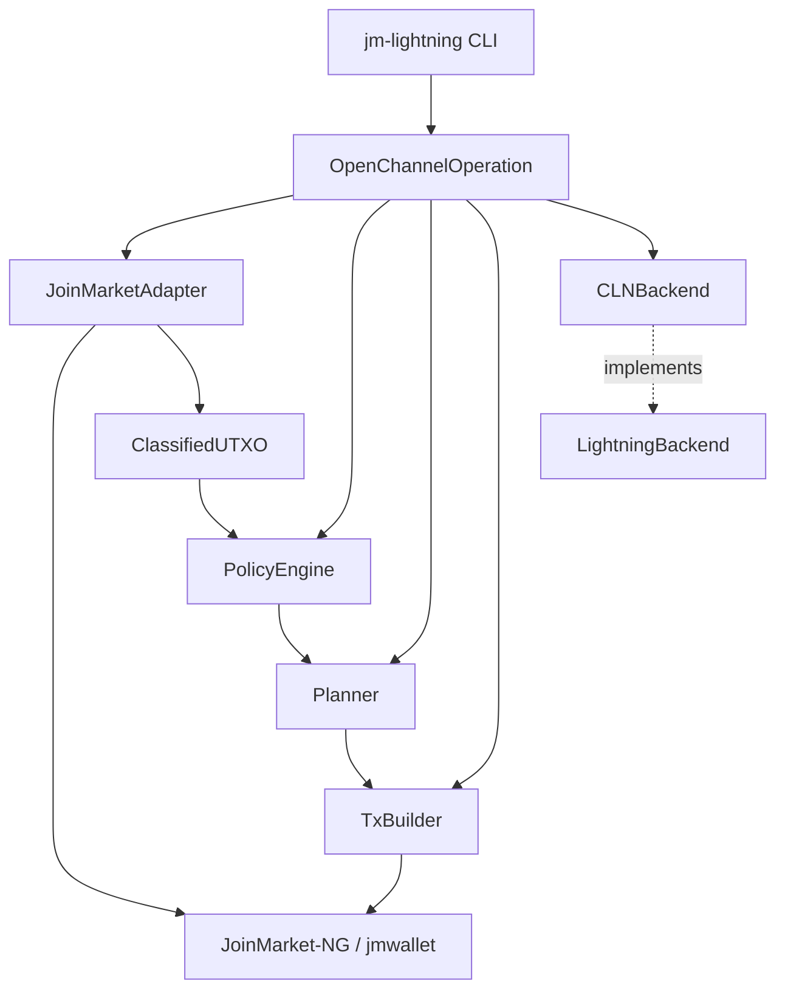
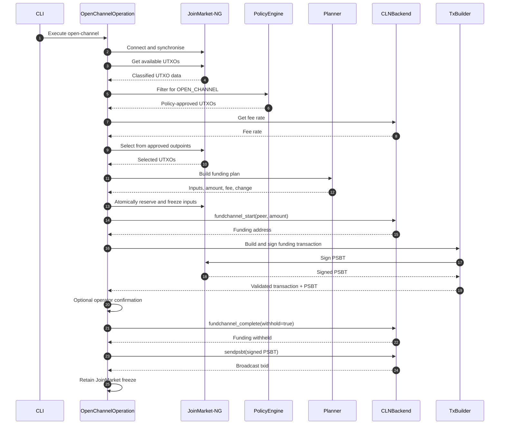

# ⚡ jmlightning

**JoinMarket-NG to Lightning Network Bridge** - A privacy-conscious, policy-driven bridge for funding Core Lightning channels from JoinMarket-NG wallet UTXOs. Submarine swaps and channel splicing are planned extensions.

[](https://opensource.org/licenses/MIT)
[](https://www.python.org/)
[](https://github.com/astral-sh/ruff)
[](https://mypy-lang.org/)

[](https://github.com/aido/jmlightning/actions/workflows/static.yml)
[](https://github.com/aido/jmlightning/actions/workflows/unit.yml)
[](https://github.com/aido/jmlightning/actions/workflows/regtest.yml)
[](https://github.com/aido/jmlightning/actions/workflows/codeql.yml)
[](https://codecov.io/gh/aido/jmlightning)
---

## 📋 Overview

`jmlightning` connects **JoinMarket-NG** wallets with a **Lightning** node while keeping JoinMarket's UTXO privacy policy at the centre of the transaction flow.

`jmlightning` uses the JoinMarket-NG wallet, wallet models and wallet configuration as the source of truth for Bitcoin funds and their privacy classification.

`jmlightning` is not primarily adding a new privacy property to JoinMarket-NG; it provides a controlled, selective external-spending path that avoids having to sweep/consolidate an entire mixdepth when funding Lightning.

JoinMarket-NG remains responsible for the wallet itself. `jmlightning` sits on top of that wallet and adds a controlled path from classified JoinMarket UTXOs to Lightning operations.

The relationship can be thought of as:

- JoinMarket-NG owns the wallet and its funds.
- JoinMarket-NG provides the wallet's UTXO and address information.
- `jmlightning` translates those classifications into internal objects and applies an operation policy to them.
- `jmlightning` plans and constructs the resulting Bitcoin transaction.
- JoinMarket-NG is used to sign transactions with the wallet.
- The Lightning node performs the Lightning-side channel operation.
- Future operations, such as submarine swaps, remain subject to the same UTXO policy.

The project separates three concerns:

1. **JoinMarket-NG** determines the origin and privacy classification of wallet UTXOs.
2. **The policy engine** determines what each classified UTXO is permitted to be used for.
3. **Operations and execution components** perform the requested action only after the policy layer has approved it.

The initial focus is Lightning channel funding. The architecture is designed to support additional operations, including submarine swaps, without allowing execution code to bypass JoinMarket's UTXO policy.

### The Core Privacy Problem

A JoinMarket wallet can contain UTXOs with very different privacy characteristics.

For example:

- **`cj-out`** - a CoinJoin output that has received the intended equal-value CoinJoin denomination.
- **`cj-change`** - change produced by a CoinJoin transaction and therefore linked to the CoinJoin inputs.
- **`deposit`** - an externally received, unmixed UTXO.
- **`non-cj-change`** - ordinary wallet change that has not acquired CoinJoin privacy.

These classifications matter when deciding what a UTXO can safely be used for.

In particular, using toxic or otherwise unsuitable change together with a CoinJoin output can create common-input ownership links and undermine the privacy gained through CoinJoin.

### The Solution

`jmlightning` follows a simple architectural rule:

> **JoinMarket-NG provides the wallet's UTXO classifications; jmlightning applies operation-specific policy to those classifications.**

The goal is not to replace JoinMarket's wallet selection or classification. It is to provide a selective path from a JoinMarket mixdepth to Lightning.

A generic sweep of a mixdepth can consolidate UTXOs with different privacy histories before the funds reach Lightning. `jmlightning` instead restricts funding selections to UTXOs permitted by the policy, allowing an eligible CoinJoin output to fund a channel without first sweeping unrelated mixdepth funds.

The Lightning layer does not independently decide whether a UTXO is suitable for channel funding.

Instead, UTXOs are classified by the JoinMarket adapter and passed through a capability-based policy engine. An operation such as opening a Lightning channel requests a capability such as `OPEN_CHANNEL` and only UTXOs possessing that capability may be selected.

This means that restrictions such as:

> `cj-change` must not be used to open a public Lightning channel

are enforced by the policy layer rather than relying on the CLI user to make the correct choice manually.

---

## 🚀 Installation

### Requirements

- Python **3.11 or newer**
- JoinMarket-NG
  - `jmcore`
  - `jmwallet`
- Core Lightning for channel funding
- A CLN JSON-RPC Unix socket accessible by the process running `jmlightning`

The exact dependency versions are defined by `pyproject.toml`.

### Clone the Repository

```bash
git clone https://github.com/aido/jmlightning.git
cd jmlightning
```

### Install

```bash
pip install -e .
```

---

## ⚙️ Configuration

`jmlightning` reuses JoinMarket-NG configuration and wallet settings rather than introducing a second wallet configuration system.

The CLI resolves JoinMarket-NG settings for the network, Bitcoin backend, data directory, wallet configuration and mnemonic. The underlying configuration precedence is provided by JoinMarket-NG; for bridge-specific command options, use the CLI options shown by `--help`.

Initialise the JoinMarket-NG configuration with:

```bash
jm-lightning config-init
```

You can specify the data directory or configuration file explicitly:

```bash
jm-lightning config-init \
  --data-dir /path/to/joinmarket-data \
  --config-file /path/to/config.toml
```

The current `open-channel` command does **not** consume a separate `jmlightning` `[lightning]` TOML section. The CLN RPC socket is supplied with `--cln-socket`; amount, mixdepth, mnemonic file and confirmation behaviour are also command-line options.

Do not commit RPC credentials, wallet secrets, mnemonics or other sensitive configuration to source control.

## 💻 Usage

### CLI Structure

Commands follow the JoinMarket-NG-style subcommand structure:

```text
jm-lightning <command> <parameter> <parameter>
```

The CLI command selects an application operation. The operation then applies the appropriate capability policy and coordinates the required wallet, planning and backend services.

---

### Open a Lightning Channel

A channel funding operation requests the `OPEN_CHANNEL` capability.

For example:

```bash
jm-lightning open-channel \
  02abc1234567890abcdef1234567890abcdef1234567890abcdef1234567890 \
  --amount 1000000 \
  --mixdepth 1 \
  --cln-socket /run/lightningd/lightning-rpc
```

The important part of this command is not simply the requested amount.

The application will:

1. Dispatch the command to `OpenChannelOperation`.
2. Connect to the JoinMarket wallet.
3. Discover and classify available UTXOs.
4. Ask the policy engine for UTXOs capable of `OPEN_CHANNEL`.
5. Reject UTXOs that do not have that capability.
6. Obtain a fee estimate from CLN.
7. Select and plan the funding transaction from the approved UTXOs.
8. Lock the selected UTXOs before starting CLN funding.
9. Ask CLN for a funding address and construct/sign the funding transaction.
10. Optionally ask the operator to confirm the transaction.
11. Complete the CLN funding operation with the signed PSBT withheld.
12. Send the PSBT through CLN, which finalises and broadcasts the funding transaction.
13. Retain the JoinMarket freeze after successful broadcast; ambiguous failures keep the inputs locked for recovery.

The operation is implemented in:

```text
src/jmlightning/operations/open_channel.py
```

The CLI itself is responsible for parsing the command and dispatching the request to the operation.

Run:

```bash
jm-lightning --help
```

and:

```bash
jm-lightning open-channel --help
```

for the options supported by the installed version.

---

### Sweep Mode

A channel funding request with:

```bash
--amount 0
```

is treated as a sweep of the policy-approved UTXOs.

For example:

```bash
jm-lightning open-channel \
  02abc1234567890abcdef1234567890abcdef1234567890abcdef1234567890 \
  --amount 0 \
  --mixdepth 1 \
  --cln-socket /run/lightningd/lightning-rpc
```

Sweep mode does **not** bypass the capability policy.

Only UTXOs permitted for `OPEN_CHANNEL` are included.

---

## 🏗 Architecture

The project is deliberately divided into a small number of layers. The CLI dispatches to an operation; the operation coordinates policy, planning, transaction construction and CLN; the JoinMarket adapter isolates `jmwallet` details.



### Design Principles

The architecture is built around several principles:

- **Policy before execution** - transaction execution cannot bypass UTXO capability checks.
- **Operations coordinate workflows** - command-specific application logic belongs in `operations/`, not in the CLI.
- **Separation of concerns** - JoinMarket-specific code stays in the adapter layer.
- **Backend abstraction** - Lightning functionality is accessed through a backend interface rather than being hard-coded into the policy engine.
- **Dedicated planning** - fee-aware transaction planning is handled by a dedicated planner after the operation has constrained the selection to policy-approved UTXOs.
- **Minimal trust boundaries** - external systems provide data or execution services, while the local policy engine decides whether an operation is permitted.
- **Privacy by construction** - privacy-sensitive restrictions are encoded in software rather than left to operator discipline.

---

## 🔄 Channel Funding Flow

This is the central flow implemented by the current code. Policy and planning happen before CLN is asked to start funding, and the selected UTXOs are locked before the CLN funding operation is created.



The important property is that **the Lightning backend never chooses arbitrary JoinMarket UTXOs**. The inputs originate from JoinMarket-NG, are filtered by the local capability policy, selected only from that approved set, and locked before CLN funding is started.

If an RPC outcome is ambiguous, the operation deliberately prefers retaining the JoinMarket locks and requiring recovery rather than assuming the transaction was harmlessly abandoned.

## 🔒 Policy Engine & Capabilities

UTXOs are represented internally as classified coins with a set of capabilities.

The policy engine maps JoinMarket address classifications to permitted operations.

A simplified policy is:

| Address Status | Allowed Capabilities | Purpose |
|---|---|---|
| **`cj-out`** | `OPEN_CHANNEL`, `SPLICE`, `SWAP`, `REMIX` | CoinJoin output permitted for direct channel funding and other currently defined capabilities |
| **`cj-change`** | `SWAP`, `REMIX` | CoinJoin change; not permitted for direct channel funding |
| **`non-cj-change`** | `SWAP`, `REMIX` | Ordinary change; not permitted for direct channel funding |
| **`deposit`** | `SWAP`, `REMIX` | External/unmixed funds; not permitted for direct channel funding |
| **`reused`** | `SWAP`, `REMIX` | Reused address state; not permitted for direct channel funding |
| **`new`** | `REMIX` | Newly derived address state; not permitted for direct channel funding |
| **`reserved`**, **`bond`**, **`flagged`**, **`used-empty`** | none | Restricted states |

The exact policy is implemented in `policy.py` and should be treated as the authoritative source rather than the above table.

### Capability-Based Validation

An operation does not ask:

> "Is this UTXO a `cj-out`?"

Instead, it asks:

> "Does this UTXO have the capability required by this operation?"

For example:

```text
OPEN_CHANNEL
     │
     ▼
PolicyEngine
     │
     ├── cj-out       → allowed
     ├── cj-change    → denied
     ├── deposit      → denied
     └── restricted   → denied
```

This abstraction is important because it allows new operations to be introduced without duplicating privacy rules throughout the application.

---

## 🧠 Policy-Constrained UTXO Selection

UTXO selection is not treated as a simple "find enough sats" problem.

The operation and planner together consider:

- UTXO eligibility and required capability
- target amount
- transaction fees
- available inputs
- change
- the privacy implications of combining inputs

For fixed-amount funding, the operation delegates coin selection to JoinMarket-NG, constrained to the policy-approved outpoints. The planner then validates the resulting selection against the requested amount, fee and change rules.

The project should therefore not claim a stronger single-input privacy guarantee than the JoinMarket-NG selector and current CLI actually provide. Combining inputs can reveal ownership relationships and remains a privacy consideration.

### Sweep Mode

A sweep is different from a fixed-amount funding request.

For `--amount 0`, the operation should consider the UTXOs that have already passed the required capability policy and construct a plan using those approved inputs.

Sweep mode therefore does not bypass the policy engine.

---

## 🐍 Programmatic Architecture

The internal modules are deliberately separated so that policy and planning do not depend on CLN RPC details. The CLI is the current supported entry point; internal classes should be treated as implementation APIs unless and until a stable public library API is documented.

The important architectural point is that the planner receives **already policy-approved UTXOs**. It does not grant capabilities or override the policy engine.

---

## 🧪 Testing

The project currently has a test suite covering:

- Core Lightning backend behaviour
- JoinMarket wallet adaptation
- UTXO classification and policy enforcement
- UTXO planning and selection
- Bitcoin transaction construction

Run the complete test suite with:

```bash
pytest
```

### Type Checking

The project uses mypy for static type checking.

Run:

```bash
mypy .
```

The source and test suite are intended to remain type-safe.

### Linting

Run:

```bash
ruff check .
```

### Formatting

Run:

```bash
ruff format .
```

A useful development check is therefore:

```bash
ruff check .
ruff format --check .
mypy .
pytest
```

---

## 🔐 Security & Privacy

`jmlightning` handles Bitcoin UTXOs, wallet information and Lightning funding transactions. Security and privacy are therefore first-class design requirements.

### UTXO Policy Is a Security Boundary

The policy engine is not merely a convenience filter.

It exists to prevent operations from using UTXOs in ways that violate the wallet's privacy policy.

Code that executes an operation should not independently construct an unrestricted list of JoinMarket UTXOs.

Instead:


should remain the normal path.

### Avoid Unnecessary Input Merging

Combining multiple UTXOs can reveal ownership relationships.

The current operation delegates fixed-amount coin selection to JoinMarket-NG, constrained to the policy-approved outpoints. The planner then validates the resulting selection against the requested amount, fee and change rules.

The project should not claim a stronger single-input privacy guarantee than the current selector and CLI actually provide. Combining inputs can reveal ownership relationships and remains a privacy consideration.

### Toxic Change

`cj-change` should not be treated as equivalent to a CoinJoin output.

A CoinJoin change output can carry transaction-history information that makes it inappropriate for certain external payments.

For this reason, the policy engine intentionally distinguishes `cj-out` from `cj-change` rather than treating both as generic "CoinJoin coins".

### Lightning RPC Security

CLN's JSON-RPC socket grants significant control over the Lightning node.

The Unix socket should therefore have restrictive permissions and should not be exposed unnecessarily to other local users or processes.

For example:

```bash
chmod 600 /run/lightningd/lightning-rpc
```

The exact ownership and permission model should match the CLN deployment.

### Secrets

Do not place any of the following in the repository:

- JoinMarket wallet mnemonics
- wallet seeds
- Bitcoin RPC passwords
- CLN credentials
- swap provider credentials
- private keys
- generated wallet files

Use appropriate secret-management mechanisms for production deployments.

---

## 📂 Repository Structure

```text
.
├── pyproject.toml
├── LICENCE
├── README.md
├── src/
│   └── jmlightning/
│       ├── __init__.py
│       ├── cli.py
│       ├── config.py
│       ├── models.py
│       ├── policy.py
│       ├── planner.py
│       ├── tx_builder.py
│       │
│       ├── adapters/
│       │   ├── __init__.py
│       │   └── joinmarket.py
│       │
│       ├── lightning/
│       │   ├── __init__.py
│       │   ├── backend.py
│       │   └── cln.py
│       │
│       └── operations/
│           ├── __init__.py
│           ├── open_channel.py
│           ├── splice.py
│           └── swap.py
│
└── tests/
    ├── conftest.py
    │
    ├── integration/
    │   └── test_open_channel_regtest.py
    │
    └── unit/
        ├── test_cln.py
        ├── test_joinmarket_adapter.py
        ├── test_open_channel.py
        ├── test_planner.py
        ├── test_policy.py
        └── test_tx_builder.py
```

### Main Components

#### `cli.py`

Defines the command-line interface and dispatches commands to application operations.

The CLI is intentionally kept thin. It handles command-line arguments and configuration, while operation-specific orchestration belongs in `operations/`.

#### `operations/open_channel.py`

Implements the Lightning channel-opening operation.

`OpenChannelOperation` coordinates:

- JoinMarket wallet UTXO discovery
- UTXO classification
- capability validation
- fee retrieval
- policy-constrained planning
- transaction construction and signing
- CLN channel funding

The operation does not define the JoinMarket privacy rules itself. Those remain in the policy engine.

#### `operations/swap.py`

Placeholder for future swap functionality. No swap protocol is currently implemented.

#### `operations/splice.py`

Placeholder for future channel-splicing functionality.

#### `models.py`

Contains the core domain objects used by the application.

The models describe UTXOs, their JoinMarket classification and the capabilities that can be applied to them.

These models deliberately do not depend on CLN RPC or JoinMarket-specific execution code.

#### `policy.py`

Contains the capability-based policy engine.

This is the main privacy boundary of the application.

#### `planner.py`

Responsible for turning eligible UTXOs and an execution request into an `ExecutionPlan`.

The planner handles UTXO selection and fee-aware transaction planning.

#### `tx_builder.py`

Constructs and signs Bitcoin transactions using the wallet integration.

It is intentionally downstream of policy evaluation and planning.

#### `adapters/joinmarket.py`

Provides the boundary between `jmlightning` and JoinMarket-NG.

It obtains wallet information and translates JoinMarket wallet state into the project's internal `ClassifiedUTXO` representation.

#### `lightning/backend.py`

Defines the Lightning backend abstraction.

The rest of the application can therefore operate against a Lightning interface rather than depending directly on CLN.

#### `lightning/cln.py`

Provides the Core Lightning implementation using CLN's JSON-RPC interface.

---

## 🧩 Extensibility

The project is designed around clear interfaces and operation boundaries rather than tying the entire application to one execution path.

### Operations

Application-level functionality belongs in `operations/`.

Conceptually:


Each operation coordinates its own workflow while obtaining UTXOs through the shared capability policy.

This keeps `cli.py` focused on command parsing and dispatch while preventing operation-specific orchestration from accumulating in a single CLI module.

### Lightning Backends

The Lightning abstraction allows future implementations beyond CLN.

Conceptually:

```text
LightningBackend
       │
       ├── CLNBackend
       ├── Future backend
       └── Future backend
```

The policy and planning layers should not need to know which Lightning implementation is being used.

### Future Operations

Submarine swaps and channel splicing are planned extensions. The current `operations/swap.py` and `operations/splice.py` files are placeholders; they do not implement those operations yet.

When implemented, additional operations must use the same capability-based policy boundary as channel funding. Provider- or protocol-specific details should remain inside the relevant operation unless a separate abstraction is justified by actual requirements.

### JoinMarket Adapters

JoinMarket-NG interaction is isolated behind an adapter.

This means the core policy and planning code can work with the project's internal models without depending on the details of `jmwallet`.

---

## 🗺 Roadmap

The project is being developed incrementally.

### Current Focus

- JoinMarket-NG wallet integration
- UTXO classification
- Capability-based policy enforcement
- Policy-constrained UTXO selection
- Core Lightning channel funding
- Transaction construction and signing
- Operation-oriented CLI architecture
- Strong typing and automated tests

### Future Work

Potential future development includes:

- **Submarine swaps**, potentially including PeerSwap via CLN
- **Additional Lightning backends**

- **More sophisticated policy-constrained coin selection**

- **Improved transaction and fee planning**

- **Additional wallet recovery/import classification**

- **Expanded integration testing against real JoinMarket-NG and CLN environments**

The key constraint for future functionality is that new execution paths must preserve the existing policy boundary.

New operations should not be allowed to bypass UTXO capability checks simply because they provide a different way of moving funds.

---

## 🧭 Design Philosophy

The project can be summarised by four rules:

### 1. Classification before selection

The system first determines what a UTXO is before deciding whether it should be spent.

### 2. Policy before execution

No Lightning operation or swap implementation should decide whether a JoinMarket UTXO is appropriate for an operation.

### 3. Capability instead of scattered special cases

Operations request capabilities such as:

```text
OPEN_CHANNEL
SWAP
REMIX
SPLICE
```

rather than embedding JoinMarket-specific status checks throughout the codebase.

### 4. Privacy is part of correctness

A transaction that is valid according to Bitcoin consensus can still be incorrect according to the privacy policy of the wallet.

`jmlightning` therefore treats privacy constraints as part of application correctness rather than as optional user guidance.

---

## 📜 Licence

`jmlightning` is distributed under the **MIT Licence**.

See [LICENCE](LICENCE) for the full licence text.

---

## ⚠️ Project Status

`jmlightning` is experimental software.

It operates at the intersection of Bitcoin wallet management, CoinJoin privacy and Lightning channel funding. Users should understand the transaction and privacy implications before using it with real funds.

Always test with:

- Bitcoin regtest/testnet environments where appropriate
- Small amounts
- Dedicated development wallets

Do not assume that passing the automated test suite means that a deployment is safe for production use.

---

## 🤝 Contributing

Contributions are welcome.

Before submitting changes:

```bash
ruff check .
ruff format --check .
mypy .
pytest
```

Changes affecting privacy policy, UTXO classification, coin selection or transaction construction should include tests demonstrating the intended behaviour.

In particular, privacy-sensitive policy changes should explicitly test both:

- operations that **must be permitted** and
- operations that **must be rejected**.

The goal is to make privacy policy enforceable in code and difficult to accidentally bypass during future development.
